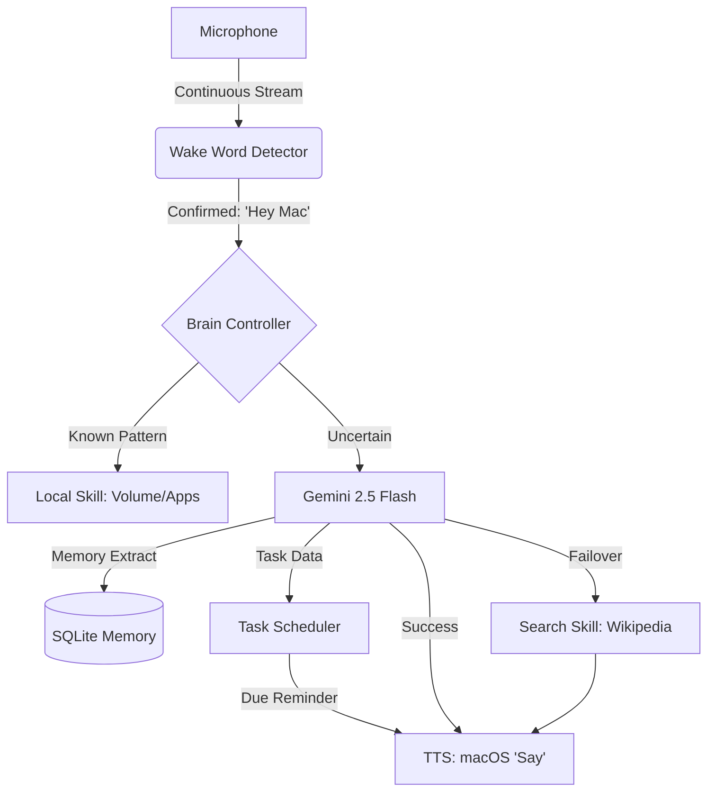

# 🚀 Macoo — High-Performance macOS AI Companion

> **"Transforming your hardcoded scripts into a seamless, context-aware Digital Assistant."**

Macoo is a premium, developer-centric voice assistant designed to sit natively on macOS. Unlike generic smart speakers, Macoo is optimized for **speed**, **local control**, and **intelligence fallbacks**. He combines the instant responsiveness of Local Regex with the deep reasoning of Google's Gemini 2.5 Flash LLM.


---

## 💎 The Macoo Philosophy

1.  **Privacy First**: No voice data is uploaded until the "Wake Word" is confirmed. 
2.  **Hybrid Intelligence**: If the internet drops or an API quota is hit, Macoo remains functional via his **Local Brain**.
3.  **Native Integration**: Macoo doesn't just talk; he controls your Mac using native AppleScript and system hooks.
4.  **Developer Experience**: Built-in CLI modes and a real-time web console make debugging and extension trivial.

---

## 🛠️ Feature Deep Dive

### 🧠 The Three-Layered Brain
Macoo never says "I don't know." He processes intents through three logical layers:
1.  **Local Pattern Engine (Regex)**: Zero-latency execution for system commands like "Volume up" or "Open VS Code."
2.  **Cloud Intelligence (Gemini 2.5 Flash)**: High-reasoning for complex questions like "Why is the sky blue?" or contextual memory extraction.
3.  **Search Fallback (Wikipedia/Google)**: If the LLM is busy or unreachable, Macoo automatically scrapes factual data from the web to ensure you get a positive answer.

### 🎤 Aggressive Wake-Word & Listener
Built on the `sounddevice` driver, Macoo features a **gapless listening loop**. This eliminates the "blind spots" found in traditional assistants, making him snap to attention the moment you say "Hey Macoo" or phonetic variations like "Mack" or "Make."

### 🎛️ Premium Dashboard (Port 5050)
The Macoo Dashboard is a glassmorphic command center:
- **Activity Stream**: A live terminal log showing every phrase heard and every response spoken.
- **Memory Vault**: Displays all learned facts about you — powered by SQLite persistent storage.
- **Scheduled Tasks**: Live countdown view of reminders and notes with checkmark completion.
- **Snooze Engine**: A dedicated interactive button to silence Macoo for 5 minutes during meetings.
- **API Status Badges**: Dynamic indicators showing if Gemini is online or if Macoo is running in Offline-Regex mode.

### 🧠 Contextual Memory (SQLite)
Macoo remembers you across sessions. Share personal facts like *"My favorite color is blue"* and he persists them locally in an encrypted SQLite database. He also logs conversation history to build richer, more personalized responses over time.

### ⏰ Proactive Task Management
Macoo doesn't just respond — he actively reminds you:
- *"Remind me to drink water in 15 minutes"* → Macoo speaks aloud when the time arrives.
- *"What's my schedule for tomorrow?"* → Macoo reads back a natural summary of your day.
- Auto-deletes reminders after firing. Zero clutter.

---

## 🏗️ System Architecture



---

## 📂 Detailed File Structure

| Path | Purpose |
|---|---|
| `main.py` | The orchestrator. Launches the UI thread, voice loop, and background alarm thread. |
| `app.py` | Flask server providing the API and serving the Dashboard UI. |
| `assistant/brain.py` | The "Decision Engine" that routes text to the correct skill or LLM. |
| `assistant/llm_engine.py` | Interface for Google Gemini with multi-model fallback and time-aware prompting. |
| `assistant/memory.py` | SQLite database handler for persistent memories, conversation logs, and scheduled tasks. |
| `assistant/wake_word.py` | The continuous audio monitor using `sounddevice` and phonetic matching. |
| `assistant/skills/` | Directory for native modules (System Control, Search, Media, Tasks, etc.). |
| `assistant/scenes.yaml` | YAML configuration for custom workflow bundles ("Ready to Code", "Meeting Mode"). |
| `static/` & `templates/` | The Glassmorphic CSS/JS/HTML dashboard files. |

---

## 🆚 Macoo vs. Siri

| Feature | Macoo (Our System) | Apple Siri |
|---|---|---|
| **Brain / Reasoning** | **Gemini 2.5 Flash** (Deep logic & coding) | Legacy NLP (Basic intents) |
| **Transparency** | **Full Activity Stream** (Live logs) | Black Box (No visibility) |
| **Customization** | **Open Ecosystem** (YAML Scenes) | Locked (Limited APIs) |
| **Privacy** | **Local-First** (Offline system commands) | Cloud-Dependent |
| **UI Experience** | **Glassmorphic Dashboard** (Web UI) | Floating Bubble (No Dashboard) |
| **Interactivity** | **Snooze Engine** (Dedicated mute timer) | None |
| **Local Speed** | **Zero-Latency Regex** for common tasks | Cloud round-trip required |
| **Screen Awareness** | **Vision-Ready** (OCR Screen reading) | **Blind** (Cannot see screen context) |
| **Terminal Integration** | **Full Shell Control** (Git, NPM, Shell) | **None** (No CLI or system-level access) |
| **Persistence** | **SQLite Local Memory** (context aware) | **Episodic** (Forgets between sessions) |
| **Task Management** | **Proactive Reminders** (Background alerts) | **Basic Timers** (No scheduling intelligence) |

### 💡 The Power User Advantage

*   **Cognitive Depth**: While Siri handles basic "set a timer" tasks, Macoo is a coding companion. He can debug Python scripts, explain complex terminal errors, and write boilerplate code using the **Gemini 2.5 Flash** engine.
*   **Operational Transparency**: No more guessing why your assistant failed. The **Live Activity Stream** on the dashboard provides a real-time developer console for every voice interaction.
*   **Extreme Latency Control**: By using a **Regex-First** approach, Macoo handles native system commands (Volume, Brightness, Apps) locally. This makes the response feel instantaneous, skipping the cloud round-trips that often slow down Siri.
*   **Open Extensibility**: Macoo is built for builders. You can add a new native "Skill" in Python in under 5 minutes, whereas Siri remains a closed, proprietary box.

---

## 🚀 The 22-Day Build Roadmap

We are following a strict trajectory to move from MVP to "Daily Driver" status.

### **Phase 1: The Brain & Beautiful UI (Days 1–5) — ✅ COMPLETE**
- [x] Initial Rebranding & Core Framework.
- [x] Gapless Wake-Word implementation.
- [x] Premium Dashboard UI & Live Sync.
- [x] Hybrid LLM + Search Fallback integration.
- [x] Scene Parser & Coding Macros.

### **Phase 2: Deep macOS Integration (Days 6–12) — 🟡 IN PROGRESS**
- [x] **Day 6:** SQLite Persistent Memory (Long-term Context).
- [x] **Day 7:** Proactive Task Management & Reminders.
- [ ] **Day 8:** Media Master & Auto-Ducking (Spotify/Music control).
- [ ] **Day 9:** Dynamic Window Management.
- [ ] **Day 10:** Background Health Monitoring (Battery/CPU alerts).
- [ ] **Day 11:** Screen OCR (Vision) — Give Macoo "Eyes".
- [ ] **Day 12:** Remote Control Tier — Telegram Bot Integration.

*(See [ROADMAP.md](ROADMAP.md) for Phases 3 and 4)*

---

## 📥 Installation

1.  **Clone the Repository**:
    ```bash
    git clone https://github.com/nerajlal/mac-the_system-assistant.git
    cd Mac
    ```
2.  **Environment Setup**:
    ```bash
    # Ensure you have PortAudio and pyobjc dependencies installed (macOS)
    # brew install portaudio
    python3 -m venv venv
    source venv/bin/activate
    pip install -r requirements.txt
    ```
3.  **Configuration**:
    Rename `.env.example` to `.env` and add your `GEMINI_API_KEY`.
4.  **Launch**:
    ```bash
    python3 main.py
    ```

---

## 🤝 Contribution
Macoo is an open-ended project. Feel free to submit PRs for new **Skills** in `assistant/skills/` or **Dashboard** improvements.

---

## ⚖️ License
Personal Use — Built for the macOS community by dedicated developers.
